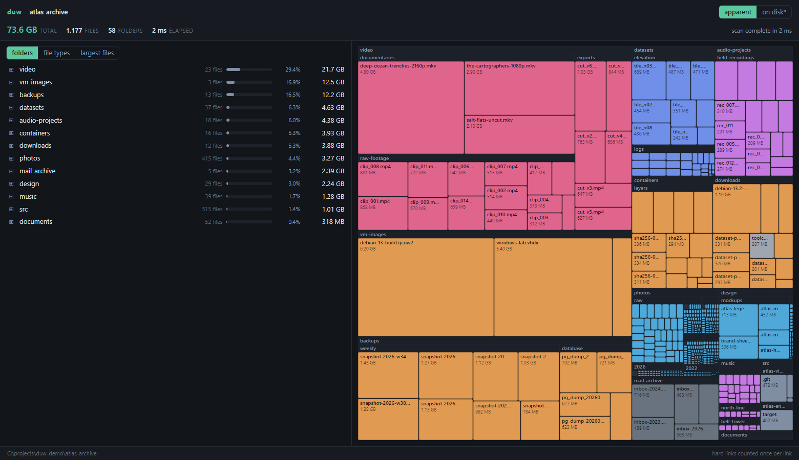

# duw

[](https://github.com/co3moz/duw/actions/workflows/ci.yml)

`du` for the browser.

```bash
duw            # scans the current directory and opens the UI
duw /var/log
```

It scans a folder and shows what is using the space, updating while the scan
runs.



## Install

```bash
curl -fsSL https://raw.githubusercontent.com/co3moz/duw/master/install.sh | sh
```

Linux, macOS and Windows, on x86_64 and arm64. The script installs into
`~/.local/bin`. On Windows, download the `.zip` from the
[releases page](https://github.com/co3moz/duw/releases/latest).

Or with Cargo:

```bash
cargo install duw
```

## The UI

- **Folders**: every item in the current folder, biggest first, with a bar that
  shows its share. Folders that usually hold files you can rebuild
  (`node_modules`, `target`, `.git`, `__pycache__`, and so on) get a small
  label.
- **File types**: everything below the current folder, grouped by category and
  by file extension.
- **Largest files**: the 100 biggest files below the current folder.
- **Duplicates**: files with identical contents, grouped and sorted by how
  much deleting the copies would free. This one reads file contents, so it only
  runs when you ask for it.
- **Treemap**: three levels deep. Click a rectangle to go into it.

Press `Backspace` or `Escape` to go up one level. Nothing is sent over the
internet. The server listens on `127.0.0.1` only, and it stops when you press
`Ctrl+C`.

## Options

```
duw [OPTIONS] [PATH]

  -p, --port <PORT>        Port to listen on (0 picks a free one)
      --host <HOST>        Address to bind [default: 127.0.0.1]
      --no-open            Do not open a browser window
  -x, --one-file-system    Skip directories on other filesystems (Unix only)
  -L, --dereference        Follow symbolic links
  -l, --count-links        Count hard-linked files once per link
      --local-only         Ignore cloud placeholders such as OneDrive or
                           iCloud files, which report a size but are not
                           on this disk (Windows only)
  -d, --max-depth <N>      Do not descend more than N levels
      --exclude <PATTERN>  Exclude entries matching a glob (repeatable)
  -X, --exclude-from <F>   Read exclude patterns from a file
  -j, --threads <N>        Scanning threads [default: number of cores]
      --duplicates         Look for duplicate files once the scan finishes
      --duplicates-min <S> Smallest file to consider, e.g. 512K, 10M [default: 512K]
```

```bash
duw --exclude '*/node_modules' --exclude '.git' ~/src
duw -d 2 --no-open -p 8080 /
```

## Building from source

The web UI is a Vite + React app. Its build output goes to `web/dist`. That
folder is committed to the repository and built into the binary, which is why a
release build does not need Node.

```bash
cd web && npm install && npm run build   # only if you changed the UI
cargo build --release
```

To work on the UI, run the backend and the dev server at the same time. Vite
sends `/api` requests to port 8080:

```bash
cargo run -- --port 8080 --no-open ~/src
cd web && npm run dev
```

Debug builds read `web/dist` from disk. Release builds embed it.

## License

MIT
